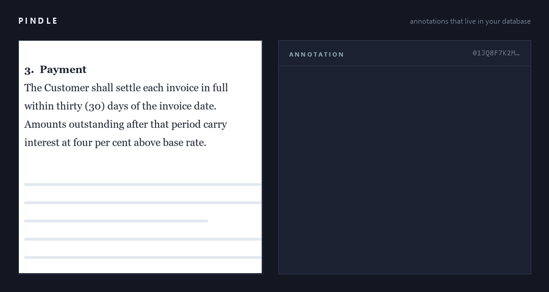
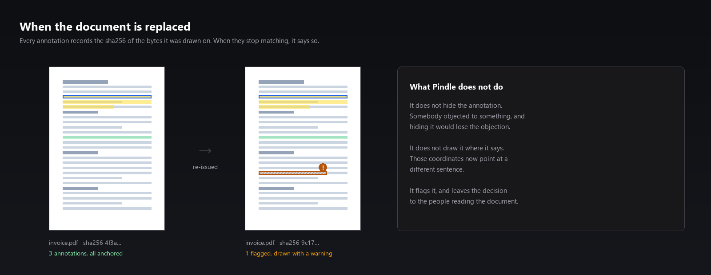
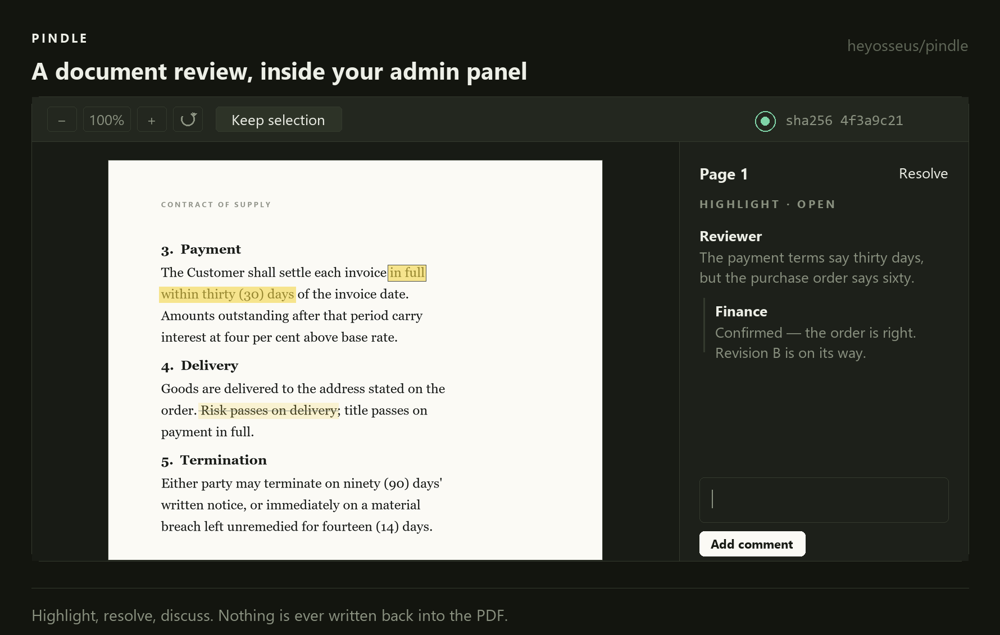
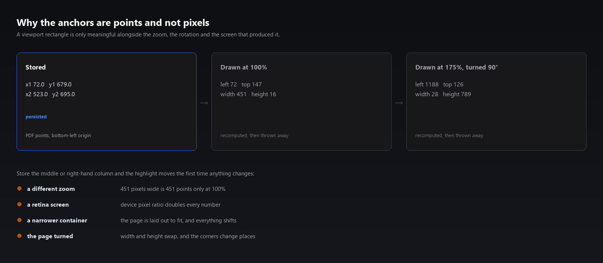

<p align="center">
  <a href="https://packagist.org/packages/heyosseus/pindle"></a>
  <a href="https://github.com/heyosseus/pindle/actions"></a>
  <a href="https://github.com/heyosseus/pindle/actions"></a>
  <a href="https://packagist.org/packages/heyosseus/pindle"></a>
  <a href="LICENSE.md"></a>
</p>

<p align="center">
  
  
  
  
</p>

# Pindle

**Your team marks up PDFs inside your app, instead of emailing them around.**

Highlights and comment threads pinned to exact coordinates on the page — stored
in your database, governed by your policies, on your servers.



```bash
composer require heyosseus/pindle
```

```blade
<x-pindle::viewer :for="$invoice" />
```

No npm. No Vite config. No build step in your application. No document leaves
your infrastructure.

---

## The problem it solves

Somebody has to approve the invoice, redline the contract, check the claim, mark
the coursework. Today that means downloading the PDF, scribbling in Preview or
Acrobat, and emailing it back — and the comments end up in an inbox instead of
in your application, where nothing can query them, nothing can enforce who saw
what, and nobody can tell you which contracts still have objections open.

Your three options have been:

|                                                | What it costs                                                                                                                                     |
| ---------------------------------------------- | ------------------------------------------------------------------------------------------------------------------------------------------------- |
| **Build it** on PDF.js                         | Weeks. Coordinate maths that breaks on the first retina screen, then persistence, then authorisation, then the fact that the PDF gets re-uploaded |
| **License an SDK** (Nutrient/PSPDFKit, Apryse) | Commercial per-application licensing, a license key in your build, and a vendor in the middle of your document pipeline                           |
| **Use a hosted viewer**                        | Your contracts on somebody else's servers                                                                                                         |

Pindle is the fourth: `composer require`, MIT, self-hosted, and the annotations
land in two ordinary tables next to your own.

## What you actually get

**The marks are rows you can query.**

```php
$invoice->pindleReview()->open;        // 3
$invoice->pindleReview()->orphaned;    // 1
$invoice->pindleReview()->isSettled(); // false

Invoice::whereHas('annotations', fn ($q) => $q->unresolved())->get();
```

That is the whole reason not to flatten comments into the PDF or hand them to a
SaaS. A flattened comment cannot be reopened, counted, or blocked on.

**It notices when the document is replaced — and can go and find the words again.**

Every annotation records the sha256 of the bytes it was drawn on. Re-upload the
contract and the old marks are flagged, not silently left pointing at whatever
now sits at those coordinates. Then Pindle offers to search the new revision for
the text the mark was made on, and move it there if you agree.



Nothing else does this. It is the difference between a review process you can
trust and one that quietly lies to you after the third revision.

**It shows up where your team already works.**

```php
PindleReviewColumn::make('review')   // "3 open · 1 orphaned" on your Filament table
PindleViewer::make('pdf_path')       // the viewer as a form field
PindleEntry::make('pdf_path')        // ...or an infolist entry
```

**And it answers "what did legal say?" from a terminal.**

```bash
php artisan pindle:export "App\Models\Contract" 4471 --format=md
```

## Table of contents

- [Install](#install) · [Use it](#use-it) · [Requirements](#requirements)
- [Review state](#review-state) — the part that makes it worth keeping in your database
- [When the document changes](#when-the-document-changes) — orphan detection and re-anchoring
- [Authorisation](#authorisation) · [Multi-tenancy](#multi-tenancy) · [Private disks](#private-disks)
- [Filament](#filament) · [Livewire](#livewire) · [Events](#events)
- [Keyboard](#keyboard) · [Exporting a review](#exporting-a-review) · [Housekeeping](#housekeeping)
- [How the anchoring works](#how-the-anchoring-works) · [Why not…](#why-not)
- [What it deliberately does not do](#what-it-deliberately-does-not-do)

## Requirements

|          |                     |
| -------- | ------------------- |
| PHP      | 8.3+                |
| Laravel  | 11, 12, 13          |
| Livewire | 3 or 4 _(optional)_ |
| Filament | 4 or 5 _(optional)_ |

Filament and Livewire are `suggest`, never `require`. A CI leg runs the whole
suite with neither installed.

Laravel 11 is tested on every commit and works, but it has left Laravel's own
security-support window — so Composer may warn you about the framework, not
about this package. Pindle keeps supporting it because applications still on 11
are the ones a package should not abandon; upgrading the framework is the real
fix, and nothing here stands in the way of it.

## Install

```bash
composer require heyosseus/pindle

php artisan vendor:publish --tag=pindle-migrations
php artisan vendor:publish --tag=pindle-assets
php artisan migrate
```

`pindle-assets` writes the pre-compiled viewer to `public/vendor/pindle`. That
is the only build step there is, and Pindle already ran it.

Add the directive to your layout, once:

```blade
    @pindleScripts
</body>
```

## Use it

Put the trait on the model the PDF belongs to:

```php
use Pindle\Concerns\HasAnnotations;

class Invoice extends Model
{
    use HasAnnotations;
}
```

That is enough if the path lives on `pdf_path`. For anything else — or for more
than one document per model:

```php
protected array $pindleDocuments = [
    'default'       => 'pdf_path',
    'delivery_note' => 'delivery_pdf_path',
];
```

And render it:

```blade
<x-pindle::viewer :for="$invoice" />
<x-pindle::viewer :for="$invoice" document="delivery_note" :height="640" :readonly="true" />
```



## Review state

```php
$review = $invoice->pindleReview();          // one document
$reviews = $invoice->pindleReviews();        // all of them, keyed

$review->total;           // 4
$review->open;            // 3
$review->resolved;        // 1
$review->orphaned;        // 1
$review->comments;        // 9
$review->lastActivityAt;  // Carbon
$review->isSettled();     // false — nothing open and nothing orphaned
$review->label();         // "3 open · 1 resolved · 1 orphaned"
```

Three queries however many annotations there are, and the document is hashed
once rather than once per mark. Use it to guard an approval button, badge a
table, or fail a nightly report.

Note that `isSettled()` counts orphans as unsettled even when they are resolved:
a closed objection to text that has since been replaced is a closed objection to
something that may no longer be there, and somebody should look.

## When the document changes

This is the part nothing else has.

Every annotation stores the sha256 of the document at the moment it was drawn.
When a document is loaded whose hash differs, affected annotations come back
with `"orphaned": true` and are drawn with a warning rather than at coordinates
that now point somewhere else.

Pindle never re-anchors on its own. It offers:

1. The reviewer opens the flagged mark and presses **Find these words in this version**.
2. Pindle searches the new document's text layer for the snippet recorded when
   the mark was made, and says which page it found it on — and whether those
   words appear more than once.
3. If the reviewer accepts, `POST /annotations/{id}/reanchor` moves the mark and
   re-hashes it against the new bytes, firing `AnnotationReanchored` with the
   hash it replaced.

Moving somebody's objection automatically, onto text an algorithm thought looked
similar, would be a worse failure than leaving it flagged. So a person decides.

## Authorisation

Every endpoint asks your policy about the **owning model**, never about the
annotation:

```php
class InvoicePolicy
{
    public function view(User $user, Invoice $invoice): bool { /* ... */ }
    public function update(User $user, Invoice $invoice): bool { /* ... */ }
}
```

Being able to _see_ an invoice lets you read its annotations; being able to
_edit_ one lets you write on it. Separate them by naming an ability of your own:

```php
// config/pindle.php
'policy' => [
    'abilities' => [
        'viewAny' => 'view',
        'create'  => 'annotate',
        'update'  => 'annotate',
        'delete'  => 'annotate',
        'resolve' => 'annotate',
    ],
],
```

An unmapped ability denies. Emptying the map closes the door; it never opens it.

### Rate limiting

The write endpoints ship behind `throttle:60,1`; the read endpoints deliberately
do not. Rendering one page of a large PDF is a burst of range requests — PDFium
asks for whatever byte spans it needs and asks again on every scroll — so a limit
tight enough to matter for writing would break reading. Posting a comment is one
request a person makes, which is the shape a rate limit is actually for.

```php
// config/pindle.php
'routes' => [
    'throttle' => env('PINDLE_THROTTLE', '60,1'), // a rate, or the name of a limiter
],
```

Set it to `null` if you would rather limit these routes yourself; `pindle:doctor`
will mention that you did, once.

## Multi-tenancy

**Pindle has no tenant column, and does not need one.** An annotation is
reachable only through a model you can already see, so whatever isolates your
invoices isolates the marks on them — one constraint in one place, rather than a
second weaker copy that can drift out of step.

Filament tenancy, `stancl/tenancy` and hand-rolled global scopes all work with
no configuration. `tests/Feature/Http/IsolationTest.php` enumerates all nine
routes and proves a user of tenant A reaches none of tenant B's through any of
them.

For constraints not expressible on the owning model:

```php
Pindle::scopeUsing(fn (Builder $query) => $query->where('created_at', '>', $cutoff));
```

## Private disks

Pindle never serves documents from a public disk and never hands out a disk URL.
Bytes go through a signed, expiring route that **re-authorises through your
policy on every request** — so a link minted while somebody had access stops
working the moment they lose it, even though the signature is still valid. A
link is also refused to anyone it was not minted for.

```php
'documents' => [
    'disk'    => env('PINDLE_DISK', 'local'),  // keep this private
    'url_ttl' => 300,
],
```

## Filament

```php
use Pindle\Filament\{PindleEntry, PindlePlugin, PindleReviewColumn, PindleReviewEntry, PindleViewer};

// The index screen: which records still have something open
PindleReviewColumn::make('review')

// The record page
PindleReviewEntry::make('review')
PindleEntry::make('pdf_path')->readonly()

// A form
PindleViewer::make('pdf_path')->documentKey('default')->viewerHeight(640)

// Panel-wide defaults
$panel->plugin(PindlePlugin::make()->viewerHeight(640))
```

The viewer field stores nothing — annotations live in Pindle's own tables — so
it never appears in what your form saves.

## Livewire

The Blade component is Livewire-safe on its own: its root carries `wire:ignore`,
so a re-render never disturbs the canvas, and the bundle re-mounts after a
navigation.

The optional wrapper is for when you want the _server_ to react:

```blade
<livewire:pindle-viewer :for="$invoice" />
```

```php
#[On('pindle:annotation-created')]
public function annotated(array $detail): void { /* ... */ }
```

## Events

`AnnotationCreated`, `AnnotationUpdated`, `AnnotationDeleted`,
`AnnotationResolved`, `AnnotationReanchored`, `CommentPosted`.

Each carries the record and the acting authenticatable, and each fires from the
model rather than the controller — so a listener hears about an annotation
whether it arrived over HTTP, from an importer, or from a job.

These are the extension point for approval workflows, which is why Pindle does
not build one.

## Keyboard

The viewer is meant to be worked through, not browsed.

| Key       |                                     |
| --------- | ----------------------------------- |
| `n` / `j` | Next mark wanting attention         |
| `p` / `k` | Previous                            |
| `r`       | Resolve or reopen the selected mark |
| `Esc`     | Put the thread away                 |

Bound to the viewer's own element, so two viewers on a page never fight, and
typing in a comment box never triggers anything.

## Exporting a review

```bash
php artisan pindle:export "App\Models\Invoice" 4471
php artisan pindle:export invoice 4471 --format=json --path=review.json
```

Or from code:

```php
(new ReviewExport($invoice))->toMarkdown();
```

Ordered by page and then by when each point was raised — the order a reader goes
through a document in.

## Housekeeping

Deleting soft-deletes, so the audit trail survives. `pindle:prune` eventually
forgets:

```bash
php artisan pindle:prune --days=90
```

Switch on `pindle.pruning.enabled` to have Pindle schedule it, or leave the
cadence null and schedule it yourself.

## How the anchoring works

Anchors are stored as rectangles in **PDF user space — bottom-left origin, in
points**:

```json
[{ "x1": 72.0, "y1": 640.2, "x2": 310.5, "y2": 655.8 }]
```

A highlight over three lines is three rectangles. Nothing scale-dependent,
rotation-dependent or viewport-dependent is ever persisted, which is why a mark
lands on the same word at 50% zoom, at 400%, on a phone, and with the page
turned sideways.



The conversion is proven on both sides: a round trip through the model in PHP,
and the client-side maths at four rotations and five zoom levels in
`js/test/coordinates.test.js`.

## Why not…

**…just use PDF.js?** You can, and you will spend the weeks on the parts this
package is: coordinate stability, persistence, authorisation, and knowing what
to do when the file is replaced. PDF.js's own annotation editor writes into the
PDF, which means the comments are not queryable and not reopenable.

**…flatten annotations into the PDF?** Then they cannot be resolved, reassigned,
counted or withdrawn, and every change rewrites the file. Pindle deliberately
never touches your PDFs.

**…license a commercial SDK?** If you need redaction, forms, digital signatures
and OCR, do — those are real products and this is not trying to be one. If you
need a team to comment on documents in your admin panel, this is `composer
require` and MIT.

## What it deliberately does not do

No OCR, no text reflow, no data extraction, no e-signatures, no approval state
machines, and no writing annotations back into the PDF. Each is a real product
in its own right, and doing any of them badly would be worse than not doing them.

## Testing

```bash
composer test    # rector, pint, phpstan (max), 100% type coverage, 100% line coverage
npm test         # the viewer's coordinate, API, store and re-anchoring tests
```

## Contributing · Security · License

[CONTRIBUTING.md](CONTRIBUTING.md) · [SECURITY.md](SECURITY.md) · MIT, see
[LICENSE.md](LICENSE.md).
